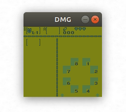
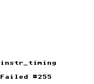

# `dmg`

GameBoy emulation in Rust




## Modules

- [`dmg01`](modules) core emulation library (cpu, ppu, apu, cartridges, etc..).
- [`dmg01/driver`](modules/backend) video & audio backends.
- [`dmg01/peripheral`](modules/peripheral) supported peripherals.
- [`dmg01/frontend`](modules/frontend) reference frontends.
    - [`native`](modules/frontend/native)
    - [`web`](modules/frontend/web)

    
## Features

| Feature | Support | Notes
| --- | :-----: | ---
| Cycle accuracy | ❌ | Out of scope (I might change my mind later).
| Classic GB | ✔️ | Works with most games, except the ones that require cycle accuracy.
| Color (CGB) | ✔️ | Still buggy. Working on it.
| Sound | | Still buggy. Working on it.
| Link cable | | In scope but not implemented yet.

## Boot ROMs

In order to include the bootstrap roms, you must own the roms for both GB and CGB (they can be found online easily).

```bash
# these must be defined when you cargo build your crate
export DMG_BOOT_GB_ROM="<path_to_gb_boot_rom>"
export DMG_BOOT_CGB_ROM="<path_to_cgb_boot_rom>"
```

Then, in your `Cargo.toml` enable the `boot` feature flag:

```toml
# Cargo.toml

[dependencies.dmg-lib]
features = ["boot"]
```

> **NOTE:** There is no built time valiation of the boot roms. Therefore it's not guaranteed that, it they were not correct, the build will still work.

## Tests

### CPU instruction tests

```bash
cargo test cpu_instrs
```


### CPU timing tests

```bash
cargo test instr_timing
```



## Tested Games

| Rom | Works | Comments
| --- | ----- | ---

## License

`TODO`

## Resources

- http://problemkaputt.de/pandocs.htm
- https://gbdev.gg8.se/wiki/
- https://github.com/AntonioND/giibiiadvance/blob/master/docs/TCAGBD.pdf
- https://gekkio.fi/files/gb-docs/gbctr.pdf
- https://github.com/gbdev/awesome-gbdev
